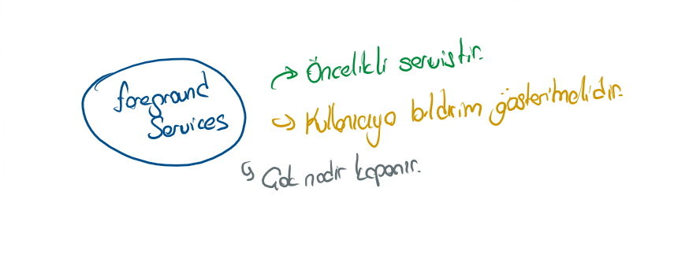

# 🌞 Foreground Service

## 🔰 Temel Hususlar



* 🔸 Kullanıcının bildirim veya arayüz ile haberi olan arka plan görevleridir
* 💎 Önceli servislerdir ve öncelik seviyesi bildirilmelidir
* 🔔 Kullanıcıya [kaldırılamayan bir bildirim](https://developer.android.com/guide/topics/ui/notifiers/notifications.html#foreground-service) gösterilmesi zorunludur
* 🌃 Kullanıcının arka plan işlemlerinden haberdar olması amaçlanır
* 👮‍♂️ Servisin çalıştırılması için [`FOREGROUND_SERVICE`](https://developer.android.com/reference/android/Manifest.permission.html#FOREGROUND_SERVICE) iznine ihtiyaç duyulur
  * 👣 Android'in [izin isteme hiyerarşisine](https://developer.android.com/guide/topics/permissions/overview) uygun ilerler
  * 🐞 İzin alınmadığı taktirde [`SecurityException`](https://developer.android.com/reference/java/lang/SecurityException.html) hatası verir


🧙‍♂️ Android dokümanında [Running a service in the foreground](https://developer.android.com/guide/components/services#Foreground) alanında işlenmektedir


## 👮‍♂️ Gerekli İzinleri Alma

* Android 8.0 ve sonrası için [`FOREGROUND_SERVICE`](https://developer.android.com/reference/android/Manifest.permission.html#FOREGROUND_SERVICE) iznine ihtiyaç duyulur
* Örnek izin sistemi için alttaki kodu kullanabilirsiniz



```java
static final int PERMISSION_FOREGORUND = 1;

void startTelemetryService() {
        if (ContextCompat.checkSelfPermission(this, Manifest.permission.FOREGROUND_SERVICE) != PackageManager.PERMISSION_GRANTED) {
            if (ActivityCompat.shouldShowRequestPermissionRationale(this, Manifest.permission.FOREGROUND_SERVICE)) {
                Toast.makeText(this, "Haberleşme hizmeti için izne ihtiyaç vardır", Toast.LENGTH_SHORT).show();
                if (Build.VERSION.SDK_INT >= Build.VERSION_CODES.P) {
                    ActivityCompat.requestPermissions(this, new String[]{Manifest.permission.FOREGROUND_SERVICE}, PERMISSION_FOREGORUND);
                }
            } else {
                if (Build.VERSION.SDK_INT >= Build.VERSION_CODES.P) {
                    ActivityCompat.requestPermissions(this, new String[]{Manifest.permission.FOREGROUND_SERVICE}, PERMISSION_FOREGORUND);
                }
            }
        } else {
            startService(new Intent(this, TelemetryService.class));
        }
    }

    @Override
    public void onRequestPermissionsResult(int requestCode, @NonNull String[] permissions, @NonNull int[] grantResults) {
        if (requestCode == PERMISSION_FOREGORUND) {
            if (grantResults.length > 0 && grantResults[0] == PackageManager.PERMISSION_GRANTED) {
                startTelemetryService();
            }
        }
    }
```





## 🧱 Temel Yapıyı Oluşturma



```java
public class TelemetryService extends Service {
    private static final String TAG = "TelemetryService";

    private Looper telemetryLooper;
    private TelemetryHandler telemetryHandler;

    public TelemetryService() {
    }

    private final class TelemetryHandler extends Handler {
        public TelemetryHandler(Looper looper) {
            super(looper);
        }

        @Override
        public void handleMessage(@NonNull Message msg) {
            try {
                Log.i(TAG, "Mesaj alındı");
                Thread.sleep(1000);
            } catch (InterruptedException e) {
                // Kesme isteği geldiğinde isteği uygulama
                Thread.currentThread().interrupt();
            }
            stopSelf(msg.arg1);
        }
    }

    @Override
    public void onCreate() {
        Log.i(TAG, "Servis oluşturuldu");

        // Arkaplanda çalışacak thread'in tanımlanması ve başlatılması (UI thread'i bloklamaması lazım)
        HandlerThread thread = new HandlerThread("TelemetryStartArguments", Process.THREAD_PRIORITY_BACKGROUND);
        thread.start();

        telemetryLooper = thread.getLooper();
        telemetryHandler = new TelemetryHandler(telemetryLooper);
    }


    @Override
    public int onStartCommand(Intent intent, int flags, int startId) {
        Log.i(TAG, "Servis başlatıldı");

        Message msg = telemetryHandler.obtainMessage();
        msg.arg1 = startId; // İsteklerin yönetimi için kimlikleri saklamalıyız
        telemetryHandler.sendMessage(msg);

        // Eğer servis öldüyse, bu dönüşten sonra Intent'siz tekrar başlat
        return START_STICKY;
    }

    @Override
    public IBinder onBind(Intent intent) {
        return null;
        // TODO: Return the communication channel to the service.
        // throw new UnsupportedOperationException("Not yet implemented");
    }

    @Override
    public void onDestroy() {
        Log.i(TAG, "Servis kapatıldı");
    }
}
```




🧙‍♂️ Ayrıntılı bilgi için [Create a Service](https://developer.android.com/guide/components/services#CreatingAService) alanına bakabilirsin.


## 🔔 Bildirim Ekleme




🧙‍♂️ Detaylı bilgiler için [Create Notification](https://developer.android.com/training/notify-user/build-notification?hl=en), [PendingIntent](https://developer.android.com/reference/android/app/PendingIntent) alanlarına bakmanda fayda var


## 🔗 Faydalı Bağlantılar

* [📖 Running a service in the foreground - Android Guides](https://developer.android.com/guide/components/services#Foreground)
* [📖 Notifications Overview - Android Guides](https://developer.android.com/guide/topics/ui/notifiers/notifications.html#appearances)

