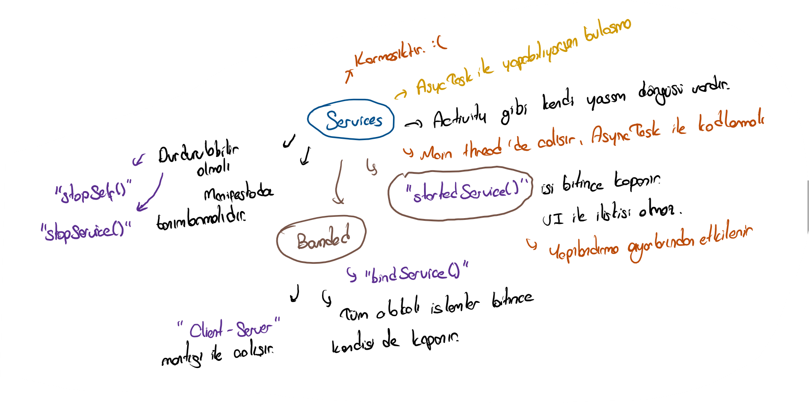

# 🔰 Servislere Giriş

## ✍ Yazılı Notlarım <a id="servislere-genel-bakis"></a>



## 👀 Servislere Genel Bakış <a id="servislere-genel-bakis"></a>

* 🤔 Arkaplanda çalışan arayüzü olmayan Activity'ler olarak adlandırılabilir
* 🚧 Android'de arkaplanda çalışmak için [Background Tasks](https://developer.android.com/guide/background) dokümanına bakılmalıdır
* ⏳ Uzun süreli işlemler için hızı ve verimliliği artırma adına [multi-threading](https://developer.android.com/training/multiple-threads/) yapısı önerilir

## 🔋 Android Pil Koruması Önlemleri

* 👮‍♂️ Android arka plan işlemlerini bataryayı korumak adına kısıtlar.
* 🚧 Kullanıcıya arayüz \(UI\) sağlamayan her arkaplan işlemi \([Background Service](https://developer.android.com/guide/components/services)\) kısıtlı sürede çalışır
* 🌞 Kısıtlanmayı engellemek adına [Foreground Service](https://app.gitbook.com/@yemreak/s/android-yemreak/~/drafts/-LuP8elEQ8QcAhafEg9U/temel-kavramlar/arkaplanda-calisma/foreground-service) yapısı kullanılmalıdır
  * 🔔 Kullanıcıya [kaldırılamayan bir bildirim](https://developer.android.com/guide/topics/ui/notifiers/notifications.html#foreground-service) gösterilir
  * 👁‍🗨 Kullanıcı arkaplan işlemlerinden haberdar olur
* 🌙 Cihaz uyku moduna girdiğinde arka plan işlemleri aksamaya başlar.
  * 🙇‍♂️ [WakeLock](https://developer.android.com/training/scheduling/wakelock#java) özelliğinin aktif olması gerekir


🧙‍♂️ Detaylı bilgi için [Challenges in background processing](https://developer.android.com/guide/background#challenges_in_background_processing) alanına bakabilirsin.




## ✅ İstek Türüne Göre Servis Seçimi

* 🦄 Servis tek bir işle baş edecek ise [IntentService](https://developer.android.com/guide/components/services#ExtendingIntentService) \(eski adı [JobIntentService](https://developer.android.com/reference/android/support/v4/app/JobIntentService)\) yapısı kullanılabilir
  * 👮‍♂️ Çok fazla kısıtlamaya tabi tutulan
  * ❌ İşi bittiğinde kapanan bir sistemdir
* 👪 Servisin birden fazla istekle baş etmesi gerekirse [IntentService](https://developer.android.com/guide/components/services#ExtendingIntentService) yerine [Service](https://developer.android.com/guide/components/services#ExtendingService) kullanılır

## 📢 Servis Tanımlama

```markup
<manifest ... >
  ...
  <application ... >
      <service android:name="ExampleService"
               android:exported="false" />
      ...
  </application>
</manifest>
```

## 💫 Yaşam Döngüsü



```kotlin
class ExampleService : Service() {
    private var startMode: Int = 0             // indicates how to behave if the service is killed
    private var binder: IBinder? = null        // interface for clients that bind
    private var allowRebind: Boolean = false   // indicates whether onRebind should be used

    override fun onCreate() {
        // The service is being created
    }

    override fun onStartCommand(intent: Intent?, flags: Int, startId: Int): Int {
        // The service is starting, due to a call to startService()
        return mStartMode
    }

    override fun onBind(intent: Intent): IBinder? {
        // A client is binding to the service with bindService()
        return mBinder
    }

    override fun onUnbind(intent: Intent): Boolean {
        // All clients have unbound with unbindService()
        return mAllowRebind
    }

    override fun onRebind(intent: Intent) {
        // A client is binding to the service with bindService(),
        // after onUnbind() has already been called
    }

    override fun onDestroy() {
        // The service is no longer used and is being destroyed
    }
}
```



```java
public class ExampleService extends Service {
    int startMode;       // indicates how to behave if the service is killed
    IBinder binder;      // interface for clients that bind
    boolean allowRebind; // indicates whether onRebind should be used

    @Override
    public void onCreate() {
        // The service is being created
    }
    @Override
    public int onStartCommand(Intent intent, int flags, int startId) {
        // The service is starting, due to a call to startService()
        return mStartMode;
    }
    @Override
    public IBinder onBind(Intent intent) {
        // A client is binding to the service with bindService()
        return mBinder;
    }
    @Override
    public boolean onUnbind(Intent intent) {
        // All clients have unbound with unbindService()
        return mAllowRebind;
    }
    @Override
    public void onRebind(Intent intent) {
        // A client is binding to the service with bindService(),
        // after onUnbind() has already been called
    }
    @Override
    public void onDestroy() {
        // The service is no longer used and is being destroyed
    }
}
```



## ⭐ Servis Örneği



```kotlin
class HelloService : Service() {

    private var serviceLooper: Looper? = null
    private var serviceHandler: ServiceHandler? = null

    // Handler that receives messages from the thread
    private inner class ServiceHandler(looper: Looper) : Handler(looper) {

        override fun handleMessage(msg: Message) {
            // Normally we would do some work here, like download a file.
            // For our sample, we just sleep for 5 seconds.
            try {
                Thread.sleep(5000)
            } catch (e: InterruptedException) {
                // Restore interrupt status.
                Thread.currentThread().interrupt()
            }

            // Stop the service using the startId, so that we don't stop
            // the service in the middle of handling another job
            stopSelf(msg.arg1)
        }
    }

    override fun onCreate() {
        // Start up the thread running the service.  Note that we create a
        // separate thread because the service normally runs in the process's
        // main thread, which we don't want to block.  We also make it
        // background priority so CPU-intensive work will not disrupt our UI.
        HandlerThread("ServiceStartArguments", Process.THREAD_PRIORITY_BACKGROUND).apply {
            start()

            // Get the HandlerThread's Looper and use it for our Handler
            serviceLooper = looper
            serviceHandler = ServiceHandler(looper)
        }
    }

    override fun onStartCommand(intent: Intent, flags: Int, startId: Int): Int {
        Toast.makeText(this, "service starting", Toast.LENGTH_SHORT).show()

        // For each start request, send a message to start a job and deliver the
        // start ID so we know which request we're stopping when we finish the job
        serviceHandler?.obtainMessage()?.also { msg ->
            msg.arg1 = startId
            serviceHandler?.sendMessage(msg)
        }

        // If we get killed, after returning from here, restart
        return START_STICKY
    }

    override fun onBind(intent: Intent): IBinder? {
        // We don't provide binding, so return null
        return null
    }

    override fun onDestroy() {
        Toast.makeText(this, "service done", Toast.LENGTH_SHORT).show()
    }
}
```



```java
public class HelloService extends Service {
  private Looper serviceLooper;
  private ServiceHandler serviceHandler;

  // Handler that receives messages from the thread
  private final class ServiceHandler extends Handler {
      public ServiceHandler(Looper looper) {
          super(looper);
      }
      @Override
      public void handleMessage(Message msg) {
          // Normally we would do some work here, like download a file.
          // For our sample, we just sleep for 5 seconds.
          try {
              Thread.sleep(5000);
          } catch (InterruptedException e) {
              // Restore interrupt status.
              Thread.currentThread().interrupt();
          }
          // Stop the service using the startId, so that we don't stop
          // the service in the middle of handling another job
          stopSelf(msg.arg1);
      }
  }

  @Override
  public void onCreate() {
    // Start up the thread running the service. Note that we create a
    // separate thread because the service normally runs in the process's
    // main thread, which we don't want to block. We also make it
    // background priority so CPU-intensive work doesn't disrupt our UI.
    HandlerThread thread = new HandlerThread("ServiceStartArguments",
            Process.THREAD_PRIORITY_BACKGROUND);
    thread.start();

    // Get the HandlerThread's Looper and use it for our Handler
    serviceLooper = thread.getLooper();
    serviceHandler = new ServiceHandler(serviceLooper);
  }

  @Override
  public int onStartCommand(Intent intent, int flags, int startId) {
      Toast.makeText(this, "service starting", Toast.LENGTH_SHORT).show();

      // For each start request, send a message to start a job and deliver the
      // start ID so we know which request we're stopping when we finish the job
      Message msg = serviceHandler.obtainMessage();
      msg.arg1 = startId;
      serviceHandler.sendMessage(msg);

      // If we get killed, after returning from here, restart
      return START_STICKY;
  }

  @Override
  public IBinder onBind(Intent intent) {
      // We don't provide binding, so return null
      return null;
  }

  @Override
  public void onDestroy() {
    Toast.makeText(this, "service done", Toast.LENGTH_SHORT).show();
  }
}
```



## 🔗 Faydalı Bağlantılar

* [📖 Service Overview - Android](https://developer.android.com/guide/components/services)

