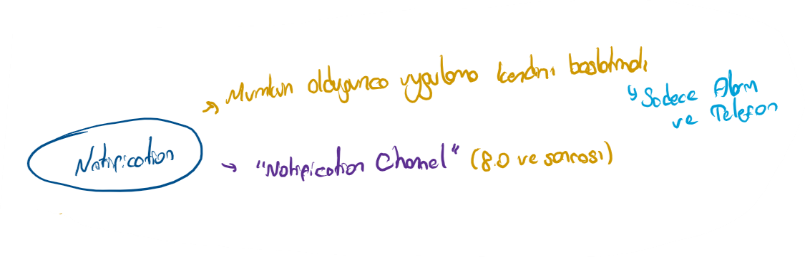
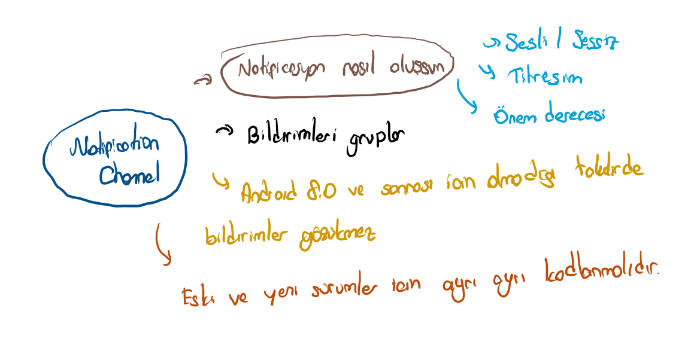
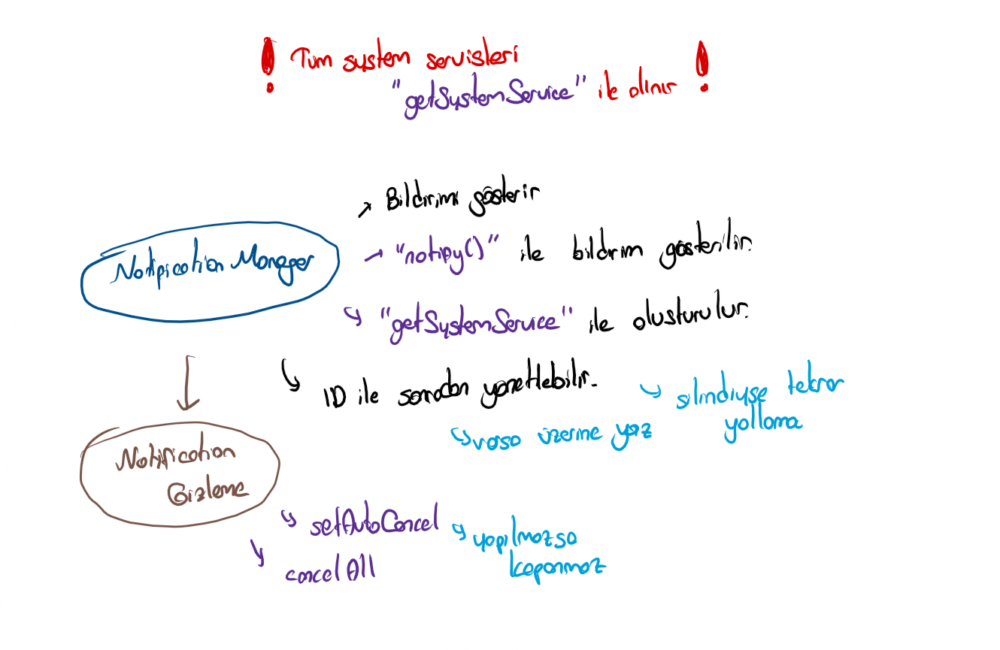
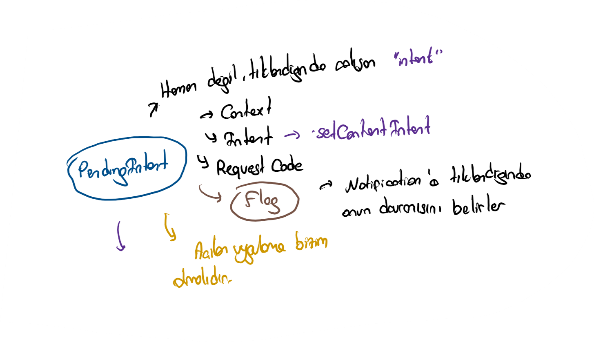
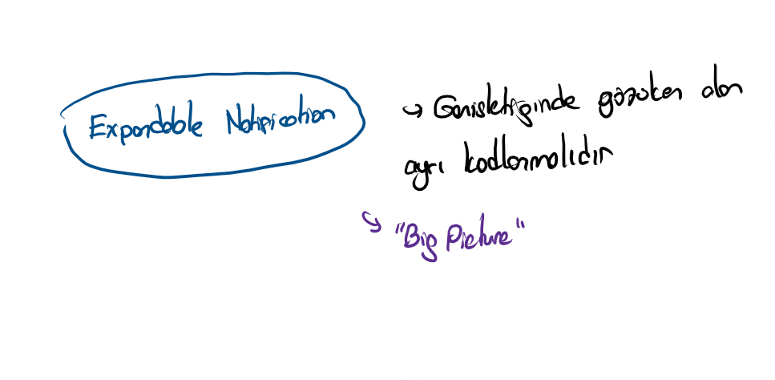
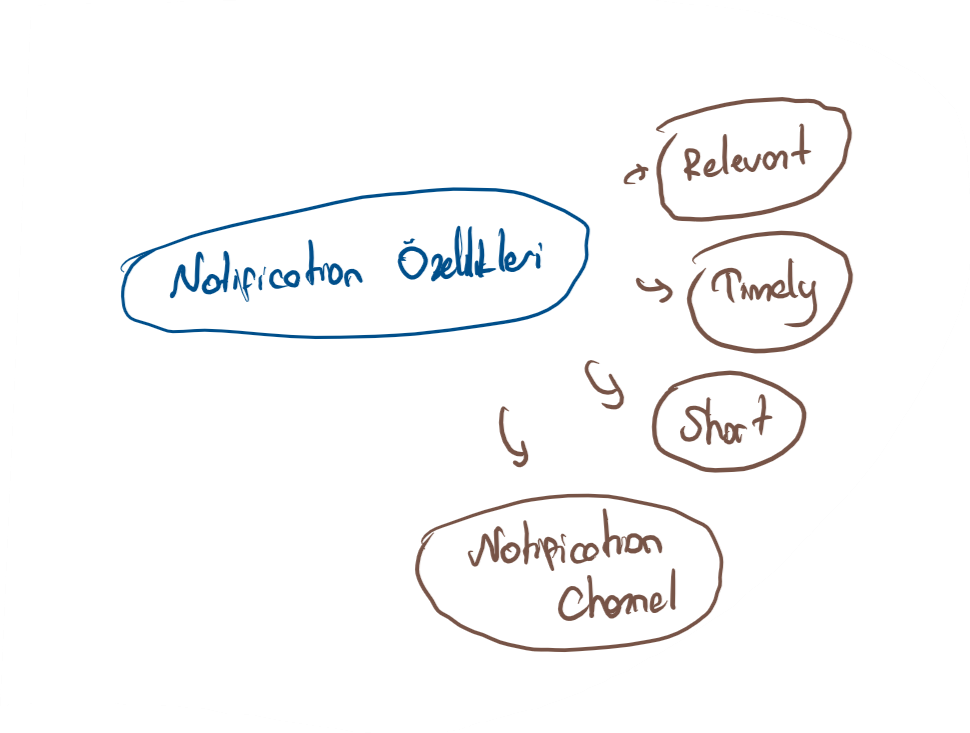

# 🔔 Notification

## 🎈 Notification Nedir





## 👨‍💼 Bildirimleri Yönetme



## 🕊️ Pending Intent



## 🎳 Geniş Bildirimler



## 💎 Bildirim Özellikleri



## 👨‍💻 Kod Örneği

```java
@RequiresApi(Build.VERSION_CODES.O)
private String createNotificationChannel() {
    String channelId = "telemetry";
    NotificationChannel channel = new NotificationChannel(channelId, "Telemetry Service", NotificationManager.IMPORTANCE_DEFAULT);
    channel.setLightColor(Color.BLUE);
    channel.setLockscreenVisibility(Notification.VISIBILITY_PRIVATE);
    NotificationManager notificationManager = (NotificationManager) getSystemService(Context.NOTIFICATION_SERVICE);
    if (notificationManager != null) {
        notificationManager.createNotificationChannel(channel);
    }

    return channelId;
}
```

