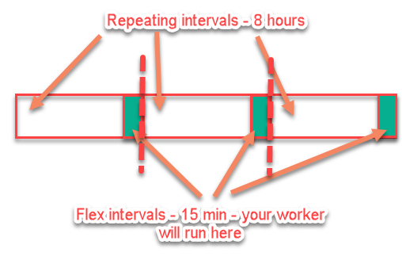

# 👷‍♂️ WorkManager

## 🚴‍♂️ WorkManager'a Giriş

* 🔄 Arka planda sunucu ile haberleşme işlemleri
* 📜 Sunucuya raporları göndermek
* 🕐 Ertelenebilir işlemler
* 💁‍♂️ Cihaz yeniden başlatılsa, uygulama kapansa bile devam eder

## 🐥 Çalışma Durumları

| 🔸 İşlem | 🔙 Devreye girme süresi |
| :--- | :--- |
| 👨‍💼️ Görev yöneticisinden kapatılma | ⌚ Belli bir süre sonra |
| 🔁 Cihazı yeninden başlatma | 🕐 Cihaz yeniden başlatıldıktan sonra |
| 👮‍♂️ Uygulamayı zorla durdurma | ✖️ Uygulama yeniden açılınca |
| 🧹 Zorla cihazı yeniden başlatma | ❌ Uygulama yeniden açılınca |


‍🧙‍♂ Detaylı bilgi için [Is WorkManager running when app is closed?](https://stackoverflow.com/questions/50682061/android-is-workmanager-running-when-app-is-closed) sorusuna bakabilirsin.


## 🕐 Periyodik Olarak Çalıştırma

* ⭐ 15 dk içerisinde, son 5 dakikalık süre içerisinde çalışır

```kotlin
workManager.enqueue(
			PeriodicWorkRequest.Builder(
				SyncCoWorker::class.java,
				15,
				TimeUnit.MINUTES,
				5,
				TimeUnit.MINUTES
			).build()
		)
```



## 🧐 Kaynaklar

* [📖 Schedule tasks with WorkManager](https://developer.android.com/topic/libraries/architecture/workmanager)
* [📖 Getting started with WorkManager](https://developer.android.com/topic/libraries/architecture/workmanager/basics)
* [👨‍🏫 Background Work with WorkManager - Kotlin](https://codelabs.developers.google.com/codelabs/android-workmanager-kt/#0)
* [👨‍🔬 Testing with WorkManager 2.1.0](https://developer.android.com/topic/libraries/architecture/workmanager/how-to/testing-210)


🚀 Bu bağlantıların hepsi [YEmoji](https://emoji.yemreak.com/kullanim/baglantilar) yapısına uygundur


