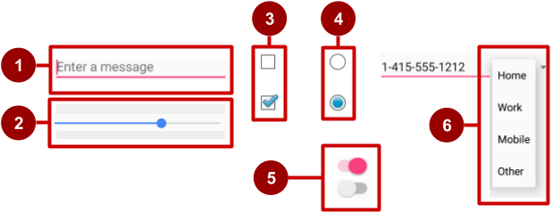

# 🧐 Component İsimleri

## 🔂 Inputlar

In the figure above:

1. [`EditText`](https://developer.android.com/reference/android/widget/EditText.html) field \(subclass of `TextView`\) for entering text using a keyboard
2. [`SeekBar`](https://developer.android.com/reference/android/widget/SeekBar.html) for sliding left or right to a setting
3. [`CheckBox`](https://developer.android.com/reference/android/widget/CheckBox.html) elements for selecting one or more options
4. [`RadioGroup`](https://developer.android.com/reference/android/widget/RadioGroup.html) of [`RadioButton`](https://developer.android.com/reference/android/widget/RadioButton.html) elements for selecting one option
5. [`Switch`](https://developer.android.com/reference/android/widget/Switch.html) for turning on or turning off an option
6. [`Spinner`](https://developer.android.com/reference/android/widget/Spinner.html) drop-down menu for selecting one option

## 🍢 Seek Bar

## ⚫ Progress Bar

## 🔀 Navigation Bar

## 🕎 Navigation View

## 💬 Alert Dialog

