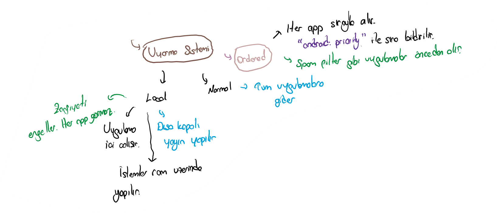

# 🏗️ Oluşturma \| Broadcast

## 👀 Metotlara Göz Atma



## 🎈 Normal Broadcast

* 🌃 Sırasız olarak tüm uygulamalara duyurulan haber yapısıdır

```java
public void sendBroadcast() {
   Intent intent = new Intent();
   intent.setAction("com.example.myproject.ACTION_SHOW_TOAST");
   // Set the optional additional information in extra field.
   intent.putExtra("data","This is a normal broadcast");
   sendBroadcast(intent);
}
```

## 🚄 Ordered Broadcast \(Sıralı\)

* 🚩 XML üzerinde belirlenen`android:priority` sırasına göre uygulamalara haber verir
* 🎲 Birden fazla aynı `android:priority` değerine sahip uygulamalara için seçim rastgele olur
* 👨‍💼 Her duyuru alan uygulama, `intent` verisini değiştirme hatta silme hakkına sahiptir

```java
public void sendOrderedBroadcast() {
   Intent intent = new Intent();

   // Set a unique action string prefixed by your app package name.
   intent.setAction("com.example.myproject.ACTION_NOTIFY");
   // Deliver the Intent.
   sendOrderedBroadcast(intent);
}
```

## 🏘️ Local Broadcast \(Yerel\)

* 🏠 Sadece uygulama içerisinde haber salınır
* 👮‍♂️ Daha güvenlidir, çünkü diğer uygulamalar erişemez
* 📈 Daha verimlidir, tüm sisteme haber salmakla uğraşılmaz

```java
LocalBroadcastManager.getInstance(this).sendBroadcast(customBroadcastIntent);
```


‍🧙‍♂ Detaylı bilgi için  [Broadcasts](https://google-developer-training.github.io/android-developer-fundamentals-course-concepts-v2/unit-3-working-in-the-background/lesson-7-background-tasks/7-3-c-broadcasts/7-3-c-broadcasts.html#broadcasts) alanına bakabilirsin.


## 👮‍♂️ İzin Gerektirenler

* 📝 Manifest dosyası üzerinde `uses-permission` ile izin alınması gerekir
* 🚫 İzni olmayanlar uygulamaların erişmesi engellenir

```java
sendBroadcast(new Intent("com.example.NOTIFY"),Manifest.permission.SEND_SMS);
```

```markup
<uses-permission android:name="android.permission.SEND_SMS"/>
```

