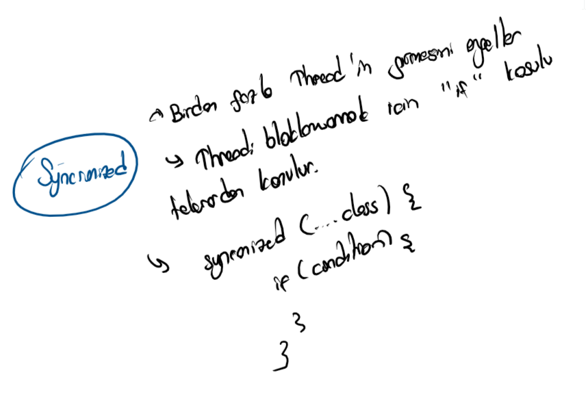

# 💽 Room Database

## 🔰 Room Database Nedir

* 🤓 SQL komutları ile uğraşmadan direkt android kodları ile çalışmamızı sağlar
* ✨ Optimize edilmiş bir veri tabanı sunar \(LiveData\)


📢 Sayfanın en altındaki linklerden resmi bağlantılara erişebilirsin.


## 🏗️ Projeye Dahil Etme

```java
dependencies {
  def room_version = "2.2.3"

  implementation "androidx.room:room-runtime:$room_version"
  annotationProcessor "androidx.room:room-compiler:$room_version" // For Kotlin use kapt instead of annotationProcessor

  // optional - Kotlin Extensions and Coroutines support for Room
  implementation "androidx.room:room-ktx:$room_version"

  // optional - RxJava support for Room
  implementation "androidx.room:room-rxjava2:$room_version"

  // optional - Guava support for Room, including Optional and ListenableFuture
  implementation "androidx.room:room-guava:$room_version"

  // Test helpers
  testImplementation "androidx.room:room-testing:$room_version"
}
```


‍🧙‍♂ Detaylar için [Declaring dependencies](https://developer.android.com/jetpack/androidx/releases/room#declaring_dependencies) alanına bakabilirsin.


## 🧱 Temel Yapı


## ⭐ Entity Yapısı

* 🧱 DB'ye aktarılacak sütun isimlerini temsil ederler
* 🏷️ [Annotation](https://www.geeksforgeeks.org/annotations-in-java/) yapısı ile özellikleri belirlenir
* 🔸 Tablodaki sütün isimleri entity üzerindeki değişkenlerle temsil edilir
* 👮‍♂️ **Primary key** ve **Entity** etiketini eklemek zorunludur


```java
@Entity(tableName = "word_table")
public class Word {
    @PrimaryKey (autoGenerate=true)
    private int wid;

    @ColumnInfo(name = "first_word")
    private String firstWord;

    @ColumnInfo(name = "last_word")
    private String lastWord;

    // Getters and setters are not shown for brevity,
    // but they're required for Room to work if variables are private.
}

```


👀 Daha fazlası için [Entity](https://google-developer-training.github.io/android-developer-fundamentals-course-concepts-v2/unit-4-saving-user-data/lesson-10-storing-data-with-room/10-1-c-room-livedata-viewmodel/10-1-c-room-livedata-viewmodel.html#entity) ve [Defining data using Room entities](https://developer.android.com/training/data-storage/room/defining-data.html) dokümanlarına bakabilirsin.


## 🛳️ DAO Yapısı

* 🐣 Tablolara erişmek için kullanılan yapıdır
* 🧱 Abstract veya Interface olmak zorundadır
* 🏷️ SQL query metinleri metotlara Annotation yapısı ile tanımlanır
* ✨ LiveData yapısı ile güncel verileri döndürür


```java
@Dao
public interface WordDao {

   // The conflict strategy defines what happens, 
   // if there is an existing entry.
   // The default action is ABORT. 
   @Insert(onConflict = OnConflictStrategy.REPLACE)
   void insert(Word word);

   // Update multiple entries with one call.
   @Update
   public void updateWords(Word... words);

   // Simple query that does not take parameters and returns nothing.
   @Query("DELETE FROM word_table")
   void deleteAll();

   // Simple query without parameters that returns values.
   @Query("SELECT * from word_table ORDER BY word ASC")
   List<Word> getAllWords();

   // Query with parameter that returns a specific word or words.
   @Query("SELECT * FROM word_table WHERE word LIKE :word ")
   public List<Word> findWord(String word);
}
```


👀 Daha fazlası için [The DAO \(data access object\)](https://google-developer-training.github.io/android-developer-fundamentals-course-concepts-v2/unit-4-saving-user-data/lesson-10-storing-data-with-room/10-1-c-room-livedata-viewmodel/10-1-c-room-livedata-viewmodel.html#dao) dokümanına bakabilirsin.


## 🗂️ Room Database

* 🧱 Abstract olmak zorundadır
* 🏗️ `Room.databaseBuilder(...)` yapısı ile db tanımlanır
* 🏷️ Database etiketi içerisinde
  *  `entities`alanında tablo verilerini temsil eden Entity Class'ınızın objesi verilir
  *  `version` alanında db'nin en son sürümünü belirtin
  * 🐛 Versiyon geçişleri arasındaki sorunları engellemek için `fallbackToDestructiveMigration()` özelliği eklenir


```java
@Database(entities = {Word.class}, version = 1)
public abstract class WordRoomDatabase extends RoomDatabase {

   public abstract WordDao wordDao();

   private static WordRoomDatabase INSTANCE;

   static WordRoomDatabase getDatabase(final Context context) {
       if (INSTANCE == null) {
           synchronized (WordRoomDatabase.class) {
               if (INSTANCE == null) {
                   INSTANCE = Room.databaseBuilder(context.getApplicationContext(),
                           WordRoomDatabase.class, "word_database")
                             // Wipes and rebuilds instead of migrating 
                             // if no Migration object.
                           .fallbackToDestructiveMigration()
                           .build();                
               }
           }
       }
       return INSTANCE;
   }
}
```


👀 Daha fazlası için [Room database](https://google-developer-training.github.io/android-developer-fundamentals-course-concepts-v2/unit-4-saving-user-data/lesson-10-storing-data-with-room/10-1-c-room-livedata-viewmodel/10-1-c-room-livedata-viewmodel.html#room) dokümanına bakabilirsin.


### 👮‍♂️ DB'yi Koruma

* ‍🚫 Veri tabanına birden çok istek gelmesini engeller
* 🐞 Birden çok isteğin eş zamanlı yapılmaya çalışması **conflict** oluşturacaktır
* 💔 Conflict yapısı veri tabanındaki verilerin uyuşmazlığını belirtir
*  Birden fazla Thread gelmesi durumunda engellemek için **synchronized** anahtar kelimesi kullanılır
* ✨ Gereksiz Thread engelinden sakınmak için, synchronized yapısı içerisinde tekrardan **if kontrolü** yapılmalıdır




👀 Detaylar için [Multi-threading](../arkaplan/multithreading.md) alanına bakabilirsin.


## 🏗️ Repository Yapısı

* 🌃 Alt katmanda olan tüm sınıfları tek bir sınıfmış gibi gösterir
  * 😏 Bu sayede **ViewModel** üzerinden birden fazla sınıfla uğraşmak zorunda kalmayız
  * 🚧 DB üzerinde yapılacak olan tüm işlemlerinde burada metot olarak tanımlanması lazımdır
* ✨ **LiveData** yapısı sayesinde verileri otomatik günceller
  * 🦄 Verilerin aktarımı bir defaya mahsus **Constructor** üzerinde yapılır
* 🌠 Verilerin aktarılması **asenkron** olması gerektiğinden [AsyncTask](../arkaplan/asynctask-ve-asynctaskloader.md) yapısı kullanılır


```java
public class WordRepository {

   private WordDao mWordDao;
   private LiveData<List<Word>> mAllWords;

   WordRepository(Application application) {
       WordRoomDatabase db = WordRoomDatabase.getDatabase(application);
       mWordDao = db.wordDao();
       mAllWords = mWordDao.getAllWords();
   }

   LiveData<List<Word>> getAllWords() {
       return mAllWords;
   }

   public void insert (Word word) {
       new insertAsyncTask(mWordDao).execute(word);
   }

   private static class insertAsyncTask extends AsyncTask<Word, Void, Void> {

       private WordDao mAsyncTaskDao;

       insertAsyncTask(WordDao dao) {
           mAsyncTaskDao = dao;
       }

       @Override
       protected Void doInBackground(final Word... words) {
           for (Word word : words) {
               mAsyncTaskDao.insert(word);
           }
       
           return null;
       }
   }
}
```

## 🛍️ ViewHolder

* 🧱 Yapılandırma değişikliklerine karşı dayanıklıdır
* 🐣 Repository ile DB'ye erişir
* 🎳 Activity context objesi gönderilmez, çok maliyetlidir
* 🥚  Context verisi miras alınmalıdır
* 📝 UI ile alakalı bilgilerin kaydı ile uğraşır


```java
public class WordViewModel extends AndroidViewModel {

   private WordRepository mRepository;

   private LiveData<List<Word>> mAllWords;

   public WordViewModel (Application application) {
       super(application);
       mRepository = new WordRepository(application);
       mAllWords = mRepository.getAllWords();
   }

   LiveData<List<Word>> getAllWords() { return mAllWords; }

   public void insert(Word word) { mRepository.insert(word); }
}
```

## ✨ LiveData

* 🔄 Verileri güncel tutmak için kullanılır
* 📈 Performansı artırır
* 🧱 Yapılandırma değişikliklerine karşı dayanıklıdır
  * 📳 Telefonu çevirme vs.
* 🍱 Tüm katmanlardaki metotlar kapsüllenmelidir
  * [🗃️ Repository](room-database.md#repository-yapisi)
  * [🛳️ DAO](room-database.md#dao-yapisi)
  * [🛍️ ViewHolder](room-database.md#viewholder)


```java
wordsViewModel.getAllNews().observe(
    this,
    words -> fillView(new ArrayList<>(news))
);

private void fillView(ArrayList<Words> words) {
    // XML layoutu üzerinden tanımlanması lazımdır
    RecyclerView recyclerView = findViewById(R.id.rv_words);
    
    // Class olarak tanımlanması lazımdır
    WordsAdapter wordsAdapter = new WordsAdapter(this, words);
    
    recyclerView.setAdapter(wordsAdapter);
    recyclerView.setLayoutManager(new LinearLayoutManager(this));
}
```


‍🧙‍♂ Detaylar için [RecycleView](https://developer.android.com/guide/topics/ui/layout/recyclerview) alanına bakabilirsiniz.


## 🔗 Faydalı Bağlantılar

* 📃 [Room, LiveData and ViewModel](https://google-developer-training.github.io/android-developer-fundamentals-course-concepts-v2/unit-4-saving-user-data/lesson-10-storing-data-with-room/10-1-c-room-livedata-viewmodel/10-1-c-room-livedata-viewmodel.html)
* 👨‍💻 [Android Room with a View - Java](https://codelabs.developers.google.com/codelabs/android-room-with-a-view/#0)
* [👁️ Android, RecycleView](https://developer.android.com/guide/topics/ui/layout/recyclerview)

