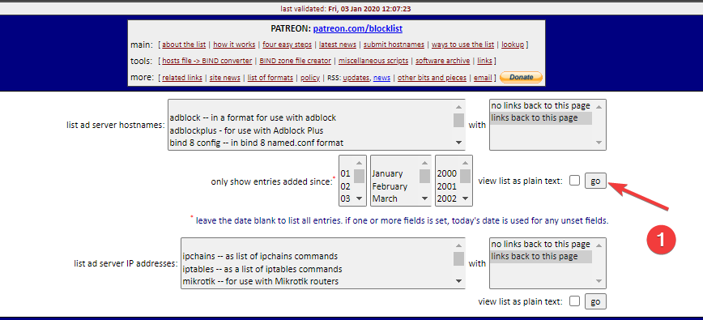
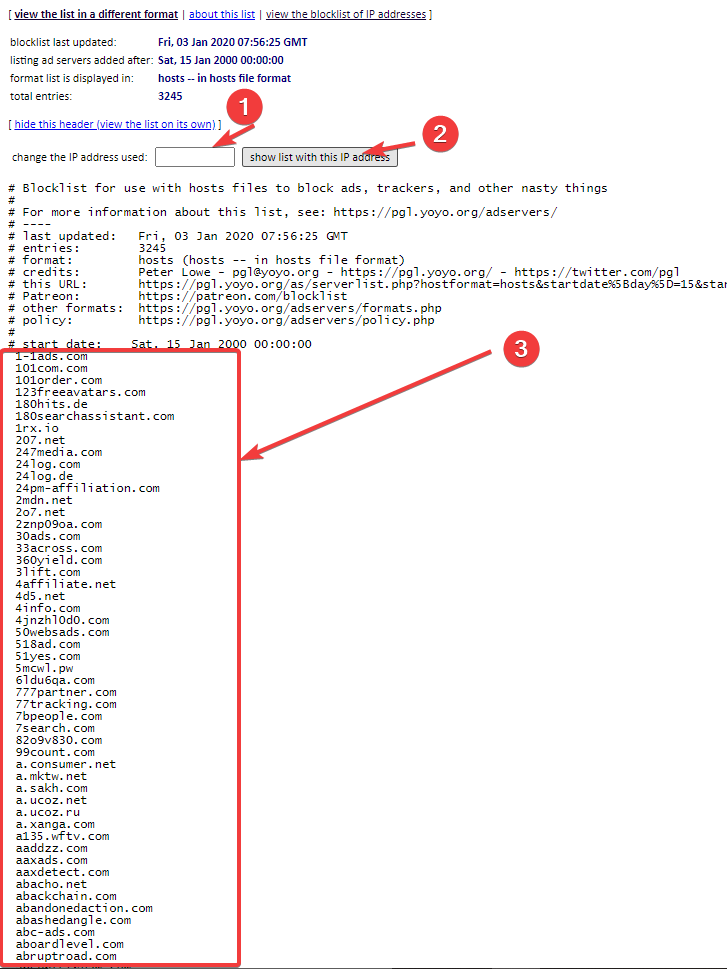
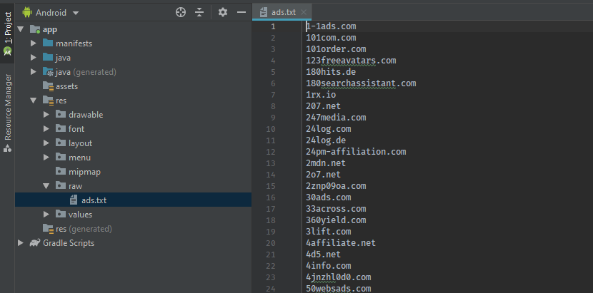

# 🚫 WebView İçerisindeki Reklamları Engelleme

## 📃 URL Listesi Oluşturma

* 🚫[ pgl.yoyo](https://pgl.yoyo.org/as/) sitesine girin
* 🏹 Sağ üstteki `go` butonuna tıklayın \(en üstteki\)
* 🧹 Üstteki kutudaki IP değerini silin ve butona basın
* 📋 Altta sıralanan tüm bağlantıları kopyalayın
* 📢 Bağlantıların başındaki  `` ⌂ Space karakterini silin
  * 📝 TXT düzenleyicisi üzerinden **replace** metodunu kullanabilirsiniz
* 🚙 Android studio üzerinden `res / raw` dizinine `ads.txt` adıyla kopyalayın







## 🏗️ Yapıyı Kurma

```java
public class AdBlocker {
    public static final String TAG = AdBlocker.class.getName();

    private static final String AD_HOSTS_FILE = "ads.txt";
    private static final Set<String> AD_HOSTS = new HashSet<>();

    public static void init(Context context) {
        new AsyncTask<Void, Void, Void>() {
            @Override
            protected Void doInBackground(Void... params) {
                try {
                    Log.d(TAG, "doInBackground: Reklam filtresi yükleniyor");
                    loadFromAssets(context);
                } catch (IOException e) {
                    // noop
                    e.printStackTrace();
                }
                return null;
            }
        }.execute();
    }

    @WorkerThread
    private static void loadFromAssets(Context context) throws IOException {
        InputStream stream = context.getResources().openRawResource(R.raw.ads);
        BufferedSource buffer = Okio.buffer(Okio.source(stream));
        String line;
        while ((line = buffer.readUtf8Line()) != null) {
            AD_HOSTS.add(line);
        }
        buffer.close();
        stream.close();
    }
}
```

## 🎈 Activity Üzerinde Tanımlama

```java
public class MainActivity extends AppCompatActivity {

    ...

    @Override
    protected void onCreate(Bundle savedInstanceState) {
        
        ...
        
        AdBlocker.init(this);
        
        ...
    }

```

## 💎 Engellemeleri Tanımlama

```java
public class AdBlocker {
    
    ...

    public static boolean isAd(String url) {
        HttpUrl httpUrl = HttpUrl.parse(url);
        return isAdHost(httpUrl != null ? httpUrl.host() : "");
    }

    private static boolean isAdHost(String host) {
        if (TextUtils.isEmpty(host)) {
            return false;
        }
        int index = host.indexOf(".");
        return index >= 0 && (AD_HOSTS.contains(host) ||
                index + 1 < host.length() && isAdHost(host.substring(index + 1)));
    }

    @TargetApi(Build.VERSION_CODES.HONEYCOMB)
    public static WebResourceResponse createEmptyResource() {
        return new WebResourceResponse("text/plain", "utf-8", new ByteArrayInputStream("".getBytes()));
    }
}
```

## 🚀 Reklamları Engelleme

```java
webView.setWebViewClient(new WebViewClient() {
private final Map<String, Boolean> loadedUrls = new HashMap<>();

@SuppressWarnings("ConstantConditions")
@TargetApi(Build.VERSION_CODES.HONEYCOMB)
@Override
public WebResourceResponse shouldInterceptRequest(WebView view, String url) {
    boolean ad;
    if (!loadedUrls.containsKey(url)) {
        ad = AdBlocker.isAd(url);
        loadedUrls.put(url, ad);
    } else {
        ad = loadedUrls.get(url);
    }
    return ad ? AdBlocker.createEmptyResource() :
            super.shouldInterceptRequest(view, url);
}
});

// HTTP protokolleri WebView'da düzgün çalışmıyor ve güvenli değil (?)
url = url.replace("http://", "https://");
webView.loadUrl(url);
```

## 🔗 Faydalı Bağlantılar

* [🚫 Android block ads in webview](https://stackoverflow.com/questions/24547446/android-block-ads-in-webview/39152846#39152846)
* [👨‍💻 Hacking up an ad blocker for Android](https://www.hidroh.com/2016/05/19/hacking-up-ad-blocker-android/)
* [📋 Ad Url List](https://pgl.yoyo.org/as/)
* [🐣 How to access a file from asset/raw directory](https://stackoverflow.com/questions/45908648/how-to-access-a-file-from-asset-raw-directory/45908819#45908819)
* [🙄 Suppress potential NullPointerException in Android Studio](https://stackoverflow.com/a/36253248/9770490)

